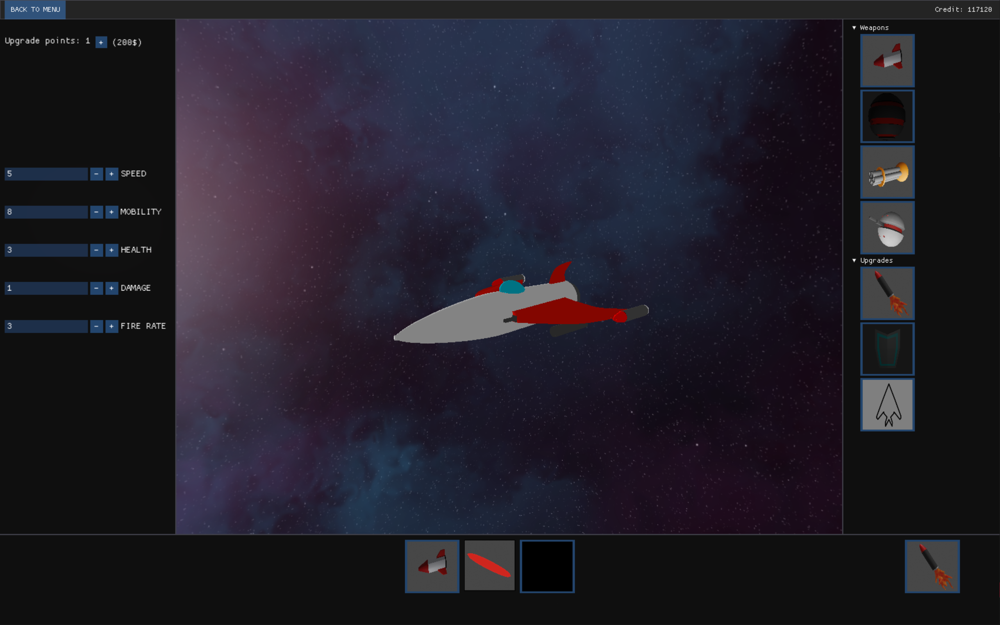
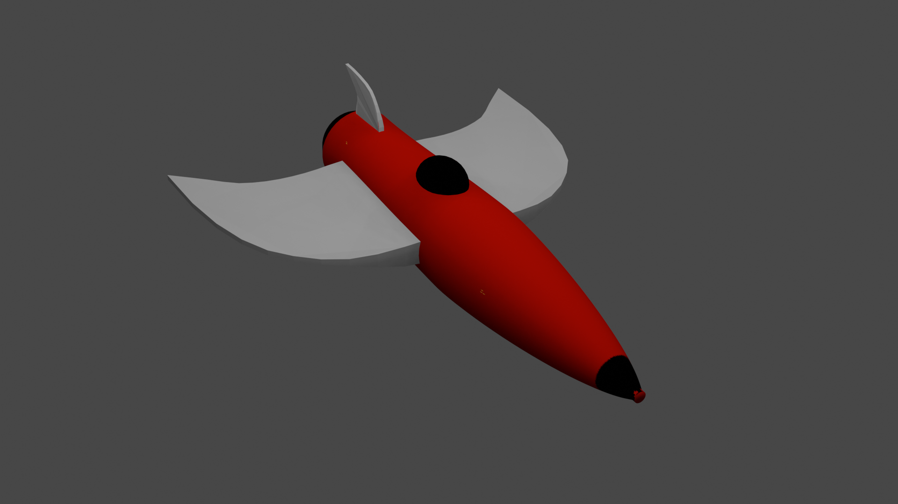
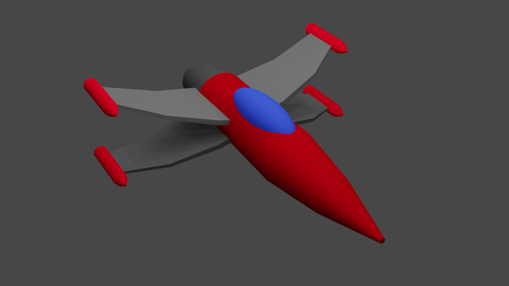
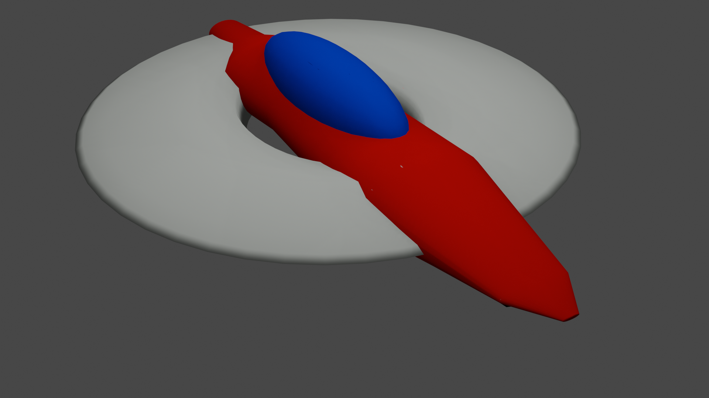
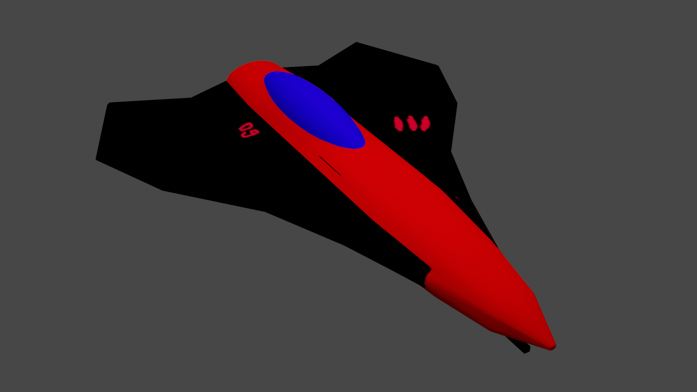
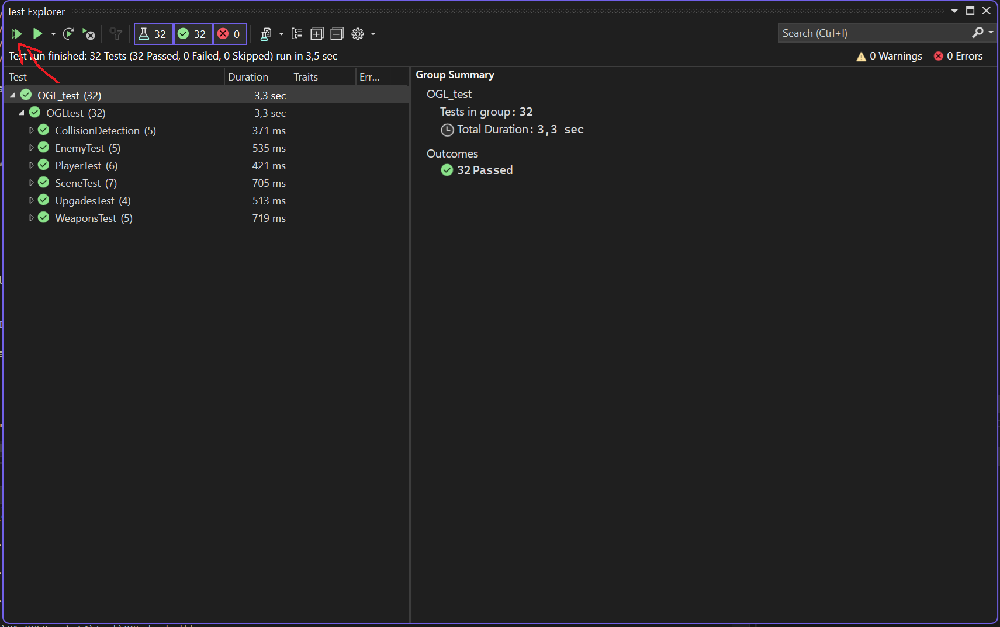
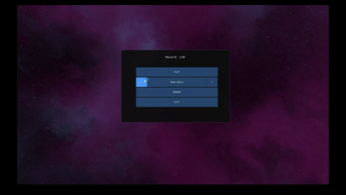
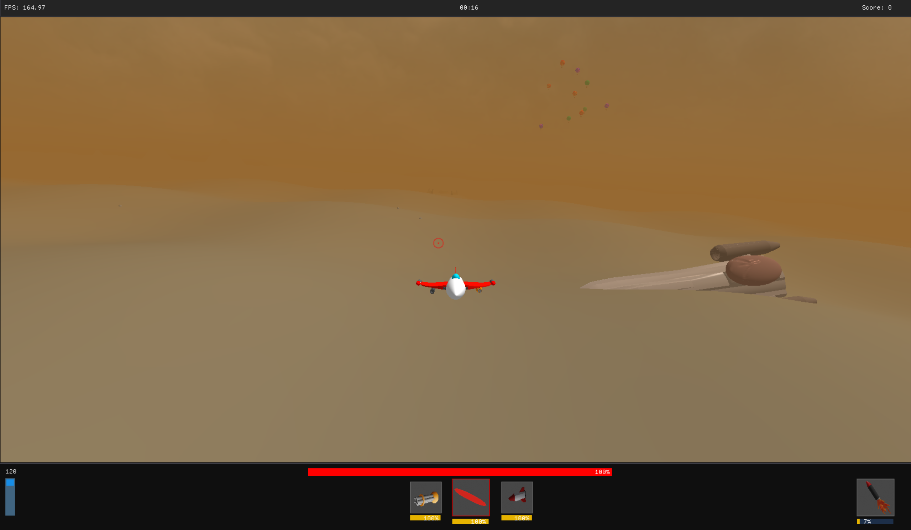

# Intergalactic
**A made from scratch single-player game where you can control, upgrade, modify your spaceship and fight againt's heuristic AI opponents.**

    

*This project was made as my Bachelor's degree thesis work at Eötvös Loránd University (ELTE - Computer Science). You can find the full thesis documentation in the "Documentation" folder, or by clicking at the link at the bottom of this page.*

## Gameplay ##
The goal of the game is to eliminate as much opponents as you can before dying. It's just you and your spacecraft against a horde of AI enemies. The longer you stay alive, the harder it gets. More opponents will spawn at the enemy base and also more dangerous spaceships will occur.

You get points after destroying an enemy spaceship and you can use these in the hangar to upgrade you ship. You can improve stats like speed or mobility or even unlock new weapons to mount on the wings.

**So go ahead, max-out your ship and beat your old record!**

## Features ##
- **Two playable maps**

- **4 different kind of enemy spaceships:**

| **SaR**  | **Falcon** | **Rocketer** | **Raptor** |
|---------- |---------- |----------|----------|
| The weakest of the enemies   | More speed and fire power  | A tanky enemy that shoots heat-seeking missiles   | The fastest, most agile enemy |
|   |    |    |   |

- **5 different improvable attributes:**

- **4 mountable weapon systems**
    - Heat-seeking missiles
    - Automated turret
    - Machine gun
    - Mine placer

- **3 extra upgrades that you can attach to your ship**:
    - Afterburner: gives a massive speed boost after activation
    - Shield: makes you immune to damage for a couple of seconds
    - cloaking device: make you invisible for enemies for a short period of time

- **tooltips to explain what each of the above does**
- **progression system**
- **Immersive sound effects and audio clues**
- **Self made models for a low-poly, cartoonish appearance**

## Controls ##
By default, you can guide the ship by moving the mouse. The spacecraft will move in the direction of the cursor and controls the roll and yaw intuitively.
- :video_game: **W,A,S,D:** More direct control of pitch and roll
- :anchor: **hold LCtrl**: Slow's down the ship fully
- :rocket: **Scroll wheel**: Direct speed control
- :boom: **Mouse left click**: Shoot
- :gun: **1, 2, 3**: Switch between weapons
- :black_nib: **LShift**: Activate special equipment
- :video_camera:: **Mouse right click**: Freelook mode
- :camera: **V**: Rear camera
- :pushpin: **Hold Q**: The ship wont follow the cursor (useful if you just want to look around in freelook mode)

## Implementation ##
This project was made from scratch with c++ and OpenGL 4.6, this means i didn't used a game engine like Unity. I implemented the engine part of the game myself (Including shaders, collision detection, the heuristic AI of the enemies etc...). The reason for this is that implementing these features were the primary focus of my thesis work, even if this is not the most common way of making a 3D game.

With that said obviously I used a few dependencies to make this project possible:
- OpenGL 4.6: graphics API
- ImGui (docking branch): User interface
- GLEW: OpenGL extension wrangler/manager
- GLM: Graphics mathematics library
- SDL: Low level acces for graphics hardware and audio

If you're curious about the details of the implementation, you can check out the [full hungarian documentation](./Documentation/doc_hun.pdf).

## Building the project ##
The easiest way to build the application is to open the project in visual studio where the code should build out of the box.

## Unit tests ##
The repository also contains a test project where I implemented a bunch of unit test-cases mainly focused on the backend logic of the game (for example collision detection). To run the tests in visual studio, click *"Test"* on the top bar then: *Test explorer* -> *run all tests (duble green arrow on the top left corner)*

## More screenshots and GIFs ##
Game menu:

Hangar menu: 

Planet Earth map:

## Notes ##
*I consider the development of this game finished for now and I dont have future plans with it. Altough it's possible that later I will come back to this project because there is still a few things I would like to add:*
- An installer
- Multiplayer possibilites
- Prettier graphics
